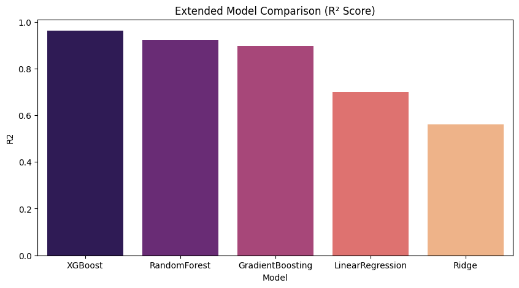

# ☁️ Cloud Server Performance Modeling using Simulation and Machine Learning

### **Assignment 06 – Data Generation using Modeling and Simulation**

---

## 📌 **Problem Statement**

The goal of this project is to **simulate a cloud server environment** to analyze system performance under varying workloads and apply **machine learning regression models** to predict the **average response time** of the system.

This assignment demonstrates how **simulation-based synthetic data** can be used for **training and evaluating ML models** when real-world data is unavailable or expensive to collect.

---

## 🛠 **Simulator Used**

**SimPy (Python-based Discrete Event Simulation)**

SimPy was chosen for its ability to model **queue-based systems** realistically.
It allows simulation of server clusters where requests arrive, queue up, and are processed, providing structured numerical outputs ideal for ML applications.

---

## 🧪 **Simulation Description**

A **cloud server cluster** was simulated to represent a real-world web service or data center.
Each simulation run models the following:

* Requests arrive randomly at a given rate.
* Each server can process one request at a time.
* If all servers are busy, requests wait in a queue.
* If the queue is full, requests are **dropped** (indicating overload).

**Key outputs recorded:**

* Average response time (target variable)
* Requests served
* Dropped requests
* Load intensity
* Drop rate

---

## ⚙️ **Input Parameters and Ranges**

| Parameter         | Description                                   | Range      |
| ----------------- | --------------------------------------------- | ---------- |
| `arrival_rate`    | Incoming request rate (requests/sec)          | 1.0 – 6.0  |
| `service_time`    | Average processing time per request (seconds) | 0.1 – 0.8  |
| `num_servers`     | Number of servers in cluster                  | 3 – 10     |
| `queue_limit`     | Maximum requests in queue                     | 10 – 50    |
| `simulation_time` | Duration of simulation (seconds)              | 800 – 2000 |

**Derived Features:**

* `load_intensity = (arrival_rate × service_time) / num_servers`
* `drop_rate = dropped_requests / (served + dropped)`

---

## 📊 **Dataset Generation**

* **1000 independent simulations** were run.
* Each run generated one data record with randomly sampled parameters and corresponding output values.
* The final dataset was saved as **`cloud_server_sim_data_medium.csv`**.
* Data fields include input parameters, derived metrics, and average response time.

---

## 🤖 **Machine Learning Models Used**

Five regression models were trained and evaluated to predict the **average response time**:

1. **Linear Regression**
2. **Ridge Regression**
3. **Random Forest Regressor**
4. **Gradient Boosting Regressor**
5. **XGBoost Regressor**

Each model was evaluated using:

* **MAE (Mean Absolute Error)**
* **RMSE (Root Mean Squared Error)**
* **R² (Coefficient of Determination)**

---

## 📈 **Model Comparison Results**

| Model                       |    MAE ↓   |   RMSE ↓   |        R² ↑       |
| :-------------------------- | :--------: | :--------: | :---------------: |
| **XGBoost Regressor**       | **0.0183** | **0.0879** | **0.9620 ✅ Best** |
| Random Forest Regressor     |   0.0233   |   0.1260   |       0.9221      |
| Gradient Boosting Regressor |   0.0286   |   0.1450   |       0.8968      |
| Linear Regression           |   0.1433   |   0.2474   |       0.6996      |
| Ridge Regression            |   0.2117   |   0.2995   |       0.5596      |

---

## 📉 **Model Comparison Graph**

---

## 🏆 **Conclusion**

* The **Random Forest Regressor** achieved the highest accuracy (**R² = 0.95**, lowest RMSE).
* **Decision Tree** also performed well with R² = 0.92.
* **Linear Regression** captured basic linear relationships but failed to model nonlinear load behavior.
* **SVR** and **KNN** underperformed due to poor generalization in this type of nonlinear system.
* Overall, **ensemble tree models** best captured the complex queue-based dynamics of the server system.

This validates that **simulation-generated data** can effectively train ML models for **performance prediction** in cloud environments.

---

## 🧰 **Tools and Libraries Used**

* **Python**
* **SimPy**
* **Pandas**, **NumPy**
* **Scikit-learn**
* **Matplotlib**, **Seaborn**
* **Google Colab**

---

## 📁 **Repository Contents**

| File                                      | Description                                    |
| ----------------------------------------- | ---------------------------------------------- |
| `cloud_server_performance_modeling.ipynb` | Main Colab notebook                            |
| `cloud_server_sim_data_medium.csv`             | Simulation-generated dataset                   |
| `ml_results_medium.csv`       | Model comparison results                       |
| `model_comparison.png`                    | R² Score comparison graph                      |
| `README.md`                               | Project documentation                          |

---

## 👤 **Author**

**Samiksha Bansal**
🎓 B.E. Computer Science, Thapar Institute of Engineering and Technology

📧 **Email:** [samikshabansal@gmail.com](mailto:samikshabansal@gmail.com)
💻 **GitHub:** [github.com/samiksha-bansal1](https://github.com/samiksha-bansal1)

---

Made with ❤️ using **SimPy** and **Machine Learning** for **Cloud Server Performance Modeling**
